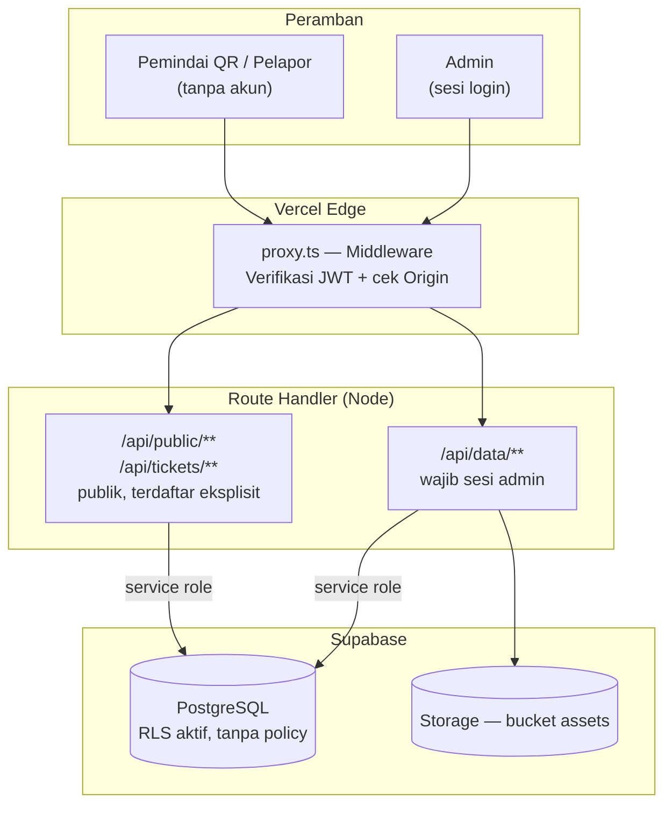
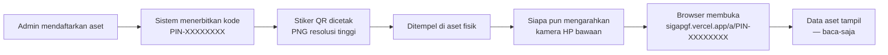
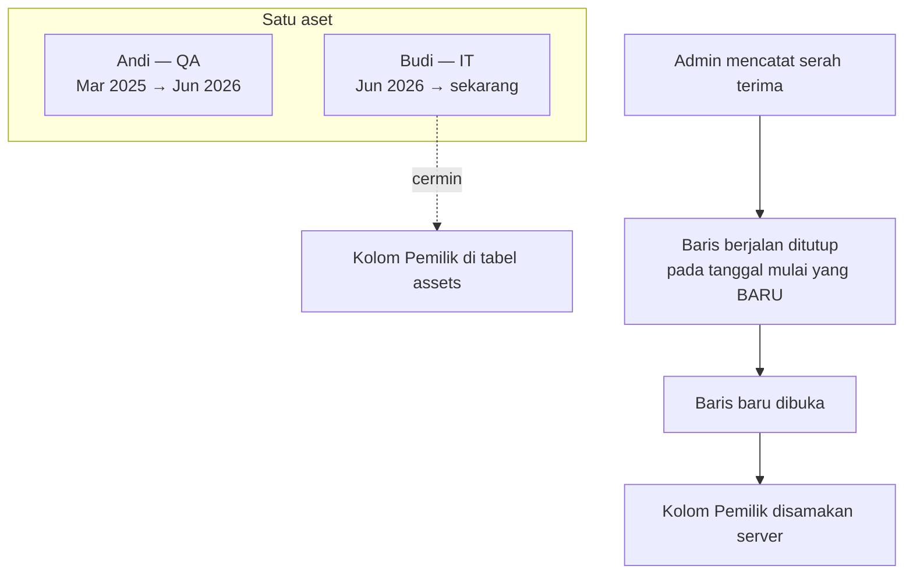
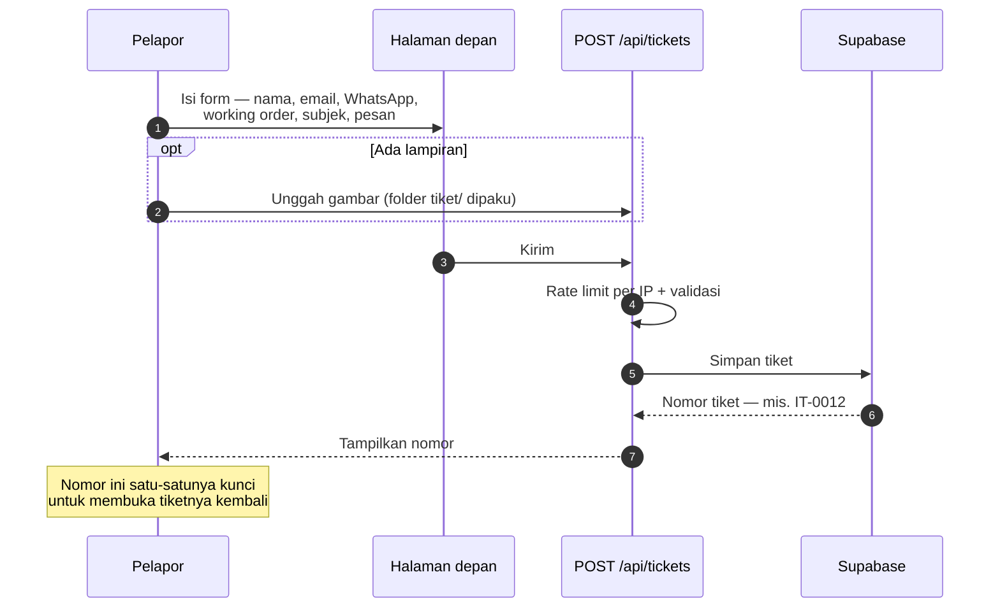
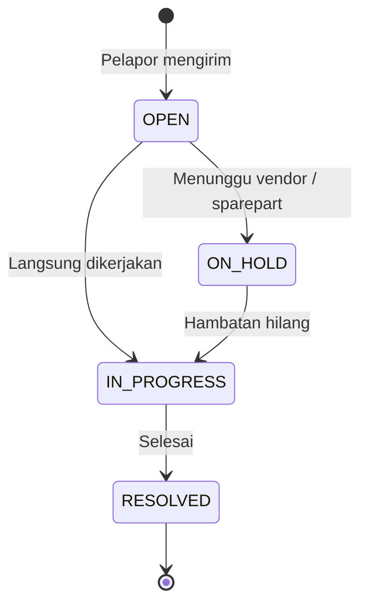
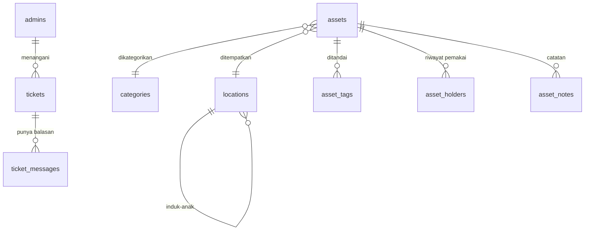
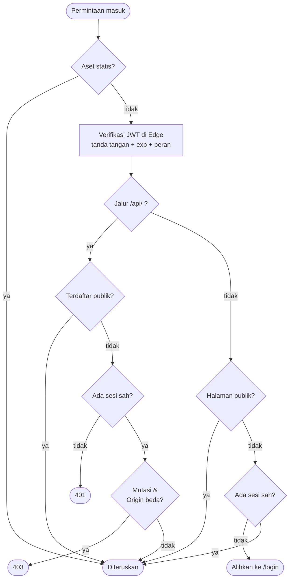
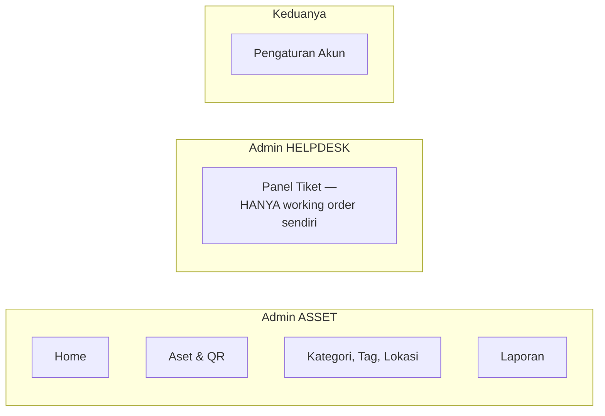
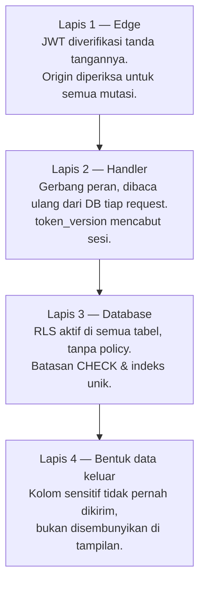

# Materi Presentasi — SIGAP

> Bahan untuk seminar Kerja Praktik. Tiap bagian `##` dirancang jadi satu
> segmen slide; diagram Mermaid bisa di-render lalu di-screenshot ke PPT
> (GitHub, VS Code + ekstensi Mermaid, atau https://mermaid.live).
>
> Usulan durasi: **20 menit presentasi + 10 menit tanya jawab**.
> Slide inti ada 18; bagian bertanda ⭑ adalah yang tidak boleh dilewat.
>
> **Alur ceritanya:** dua pilar sistem — registri aset ber-QR dan helpdesk —
> lebih dulu; keamanan menyusul sebagai bab yang menunjukkan kedalaman, bukan
> sebagai cerita utamanya.

---

## 1. Identitas Proyek

| | |
| --- | --- |
| Nama sistem | **SIGAP** — Sistem Integrasi Guna Aset & Pelayanan |
| Organisasi | Garudafood |
| Jenis | Web app: registri aset ber-QR + helpdesk |
| Produksi | https://sigapgf.vercel.app |
| Peran saya | Perancangan, implementasi, deployment, dan pengujian keamanan |

---

## 2. Latar Belakang ⭑

Dua masalah yang ditemukan di lapangan, dan keduanya bermuara pada hal yang
sama: **informasi tidak ada di tempat kejadian**.

**Aset.** Data aset tersimpan di spreadsheet yang hanya dipegang admin. Orang
yang berdiri di depan sebuah mesin tidak punya cara tahu itu aset apa, siapa
penanggung jawabnya, dan kapan terakhir diperbaiki — kecuali menelepon admin.

**Keluhan.** Laporan kerusakan masuk lewat WhatsApp dan obrolan lisan. Tidak
ada nomor, tidak ada status, dan tidak ada cara pelapor mengecek sendiri
perkembangannya.

SIGAP menjawab keduanya: **tempel QR di asetnya**, dan **beri nomor pada setiap
keluhan**.

---

## 3. Demo Pembuka — Pindai QR ⭑

> **Taruh demo di awal, bukan di akhir.** Satu momen ini menjelaskan seluruh
> sistem lebih cepat daripada lima slide arsitektur.

Persiapan: bawa satu stiker QR tercetak, tempel di benda apa pun di ruangan.

Ajak penguji mengeluarkan HP-nya sendiri, buka kamera, arahkan. Halaman aset
terbuka — **tanpa memasang aplikasi apa pun, tanpa login, tanpa dibagi tautan**.

Kalimat penutup demo:

> "Yang barusan Bapak/Ibu buka itu halaman publik. Siapa pun yang memegang
> stikernya bisa membacanya, tapi tidak ada satu pun tombol untuk mengubah
> datanya. Yang bisa mengubah hanya admin yang login."

---

## 4. Ruang Lingkup & Batasan

**Yang dikerjakan**

- Registri aset: CRUD, foto, kode QR, cetak stiker, impor massal
- Riwayat pemakai per aset
- Halaman publik hasil pindai — baca-saja
- Helpdesk: buat tiket tanpa akun, lacak dengan nomor, panel admin per meja
- Laporan inventaris + ekspor CSV/Excel/PDF

**Yang sengaja tidak dikerjakan**

- **Peminjaman aset** — pernah dibangun penuh, lalu dihapus (lihat § 18)
- Login untuk karyawan umum, multi-tenant, aplikasi mobile native
- Approval berjenjang

---

## 5. Teknologi

| Lapisan | Pilihan | Alasan singkat |
| --- | --- | --- |
| Framework | Next.js 16 (App Router), React 19, TypeScript | Satu basis kode untuk halaman dan API |
| Styling | Tailwind CSS v4 | Konsisten, cepat, mobile-first |
| Database | Supabase (PostgreSQL) | Gratis di tier awal, RLS bawaan |
| Penyimpanan | Supabase Storage | Satu penyedia dengan database |
| Autentikasi | JWT HS256 sendiri + bcrypt | Peran & working order milik SIGAP sendiri |
| Hosting | Vercel | Deploy otomatis dari `git push` |

---

## 6. Arsitektur Sistem ⭑

Satu aturan yang menentukan seluruh bentuknya: **peramban tidak pernah
menyentuh database.**

Kunci anon Supabase memang ikut terkirim ke peramban — dan itu tidak apa-apa,
karena RLS aktif di semua tabel **tanpa satu pun policy**. Hanya `service_role`
di server yang bisa membacanya.

---

## 7. Alur Aset & Kode QR ⭑

**Kenapa tidak perlu aplikasi pemindai.** QR code isinya cuma teks. Karena teks
itu berbentuk alamat web, kamera bawaan HP dan Google Lens langsung menawarkan
membukanya. Itu perilaku bawaan perangkat, bukan sesuatu yang dibangun.

**Pemindai dalam aplikasi justru dihapus.** SIGAP sempat punya halaman
`/scanner` sendiri, 562 baris. Alurnya terbalik — buka web dulu, login dulu,
baru boleh memindai — padahal yang dibutuhkan adalah orang yang lewat bisa
langsung melihat. Kamera HP menggantikannya tanpa perlu dirawat.

**Satu jebakan yang nyaris terjadi.** Alamat di dalam QR semula diambil dari
peramban yang sedang membukanya. Artinya stiker yang dicetak saat pengembangan
berisi `http://localhost:5003` — dan mati permanen begitu ditempel, karena HP
orang lain tidak punya localhost itu. Kegagalannya senyap: QR-nya terlihat
normal dan tetap terpindai. Sekarang alamatnya dipaksa dari konfigurasi
produksi.

---

## 8. Halaman Publik Hasil Pindai ⭑

Yang **tampil**: foto, nama, deskripsi, kondisi, kategori, lokasi, pemilik,
spesifikasi, nomor seri, tanggal terdaftar, dan riwayat pemakai.

Yang **sengaja tidak pernah dikirim**:

| Data | Alasan |
| --- | --- |
| Nilai / harga aset | Nilai aset perusahaan tidak perlu terbaca orang yang kebetulan lewat |
| Id internal database | Kode QR sudah cukup sebagai penunjuk; membocorkan UUID mengundang orang menebak endpoint admin |

Halaman ini juga **tidak ditaut dari mana pun** dan diberi penanda `noindex`,
sehingga tidak muncul di hasil pencarian Google. Jalan masuknya hanya stiker
yang tertempel di asetnya.

Baca-saja ditegakkan di server: berkas route-nya **tidak punya handler
POST/PATCH/DELETE sama sekali**, jadi tidak ada jalan mengubah data dari sisi
publik sekalipun kodenya diketahui.

---

## 9. Riwayat Pemakai ⭑

Menjawab pertanyaan "perangkat ini pernah dipegang siapa saja".

Dua keputusan rancangan yang layak disebut:

**Riwayat adalah sumber kebenaran, kolom Pemilik cuma cerminnya.** Kalau
keduanya boleh ditulis sendiri-sendiri, yang menang tergantung urutan
permintaan — dan dua tempat mulai bercerita berbeda.

**Aturan "satu pemakai aktif per aset" ditegakkan database, bukan aplikasi.**
Lewat indeks unik parsial. Kalau logika program kelak keliru, hasilnya error —
bukan riwayat bercabang yang diam-diam salah.

---

## 10. Helpdesk — Sisi Pelapor ⭑

**Tanpa akun, tanpa registrasi.** Ini keputusan sadar: menuntut karyawan
membuat akun hanya untuk melapor kerusakan AC akan membuat mereka kembali ke
WhatsApp.

---

## 11. Helpdesk — Meja & Siklus Status

**On Hold** membedakan "belum disentuh" dari "sudah dilihat tapi menunggu pihak
lain" — pembedaan yang hilang kalau cuma ada Open dan Diproses.

**Tiga meja terpisah.** Nomor tiket berawalan sesuai mejanya: `GA-`, `UTILITY-`,
`IT-`. Admin satu meja **tidak bisa melihat antrean meja lain** — bukan sekadar
disembunyikan di tampilan, tapi disaring di server.

---

## 12. Struktur Data

Delapan tabel, turun dari tujuh belas. Sepuluh tabel dibuang bersama modul yang
dihapus.

---

## 13. Autentikasi & Gerbang Permintaan ⭑

Tiga hal yang patut ditekankan:

- JWT **diverifikasi tanda tangannya**, bukan sekadar dicek keberadaannya.
- Endpoint publik didaftarkan **satu per satu**. Yang tidak terdaftar otomatis
  tertutup — kelalaian berujung terlalu sedikit akses, bukan terlalu banyak.
- Ganti password menaikkan `token_version`, sehingga sesi di perangkat lain
  **langsung tercabut**.

---

## 14. Pemisahan Peran

---

## 15. Keamanan — Pertahanan Berlapis ⭑

**Lapis 4 layak ditekankan.** Menyembunyikan harga aset lewat CSS bukan
keamanan — datanya tetap ada di respons dan bisa dibaca siapa pun yang membuka
tab Network. Di SIGAP kolom itu **tidak pernah ikut dikirim dari server**.

---

## 16. Temuan & Perbaikan ⭑

| Kode | Tingkat | Temuan | Status |
| --- | --- | --- | --- |
| SIGAP-01 | Sedang | `X-Forwarded-For` bisa dipalsukan untuk mereset kuota rate limit | **Ditutup** |
| DDOS-01 | Tinggi | Rate limiter jadi bottleneck-nya sendiri saat dibanjiri | **Ditutup** |
| DDOS-02 | Tinggi | Lampiran tiket tidak pernah dihapus — bucket hanya bertambah | **Ditutup** |
| DDOS-03 | Sedang | Endpoint publik dipaksa tidak bisa di-cache | **Ditutup** |
| SIGAP-02 | Tinggi | Isi tiket terbaca publik lewat nomor berurutan | Terbuka |
| SIGAP-03 | Sedang | Tabel baru otomatis terbuka untuk anon | Terbuka |

### DDOS-01 — slide dengan angka paling kuat

Pembersih rate limiter menyapu seluruh memori pada **setiap** permintaan begitu
ukurannya lewat 500. Saat dibanjiri dari banyak alamat, entri belum kedaluwarsa
sehingga sapuan tidak menghapus apa pun — memori terus tumbuh dan tiap
permintaan membayar sapuan yang makin panjang. **Pertahanannya melemah justru
ketika paling dibutuhkan.**

| Alamat IP unik | Sebelum | Sesudah | Peningkatan |
| --- | --- | --- | --- |
| 20.000 | 755 ms | 3 ms | **252×** |
| 60.000 | 6.129 ms | 16 ms | **383×** |

Yang lama tumbuh **kuadratik** — tiga kali lipat alamat berarti delapan kali
lipat waktu. Yang baru tumbuh linear.

---

## 17. Yang Sengaja Dibiarkan Terbuka ⭑

> Menyajikan temuan yang belum ditutup, lengkap dengan alasannya, jauh lebih
> kuat daripada mengklaim semuanya beres.

**SIGAP-02 — isi tiket terbaca publik.** Nomor tiket berurutan, dan halaman
lacak hanya menuntut nomor itu. Ini **bukan bug, melainkan konsekuensi
keputusan produk**: riwayat tiket sengaja dibuat bisa dibuka tanpa akun supaya
pelapor tidak kehilangan jejaknya saat berganti perangkat. Menutupnya berarti
mengubah keputusan itu — wewenang pemilik produk, bukan pengembang.

**SIGAP-03 — grant default schema.** Satu baris SQL, menunggu dijalankan di
SQL Editor produksi.

---

## 18. Hasil, Kendala & Pelajaran ⭑

**Kondisi terkini**

- Sistem berjalan di produksi dan dipakai
- Delapan tabel, dua halaman publik, tujuh halaman admin
- Empat temuan keamanan ditutup dan diverifikasi, dua terdokumentasi terbuka

**Pelajaran 1 — tahu kapan membuang.** SIGAP awalnya dibangun sebagai aplikasi
**peminjaman aset** lengkap dengan booking, kalender, keterlambatan, audit
fisik, kit, dan model aset. Setelah dipakai, ternyata kebutuhan sebenarnya
hanya: *tahu ini aset apa dan siapa pemegangnya*. Enam modul dihapus — lebih
dari 3.500 baris kode. Kode yang tidak dipakai tetap harus diuji, diperbaiki,
dan dipahami pembaca berikutnya.

**Pelajaran 2 — bug yang tidak terlihat dari membaca kode.** Kelemahan rate
limiter baru muncul saat diukur di bawah beban. Membaca fungsinya tidak
memperlihatkan apa pun yang salah.

**Pelajaran 3 — perbaikan yang ter-deploy belum tentu berfungsi.** Pembersih
lampiran otomatis sudah lama ada di kode, tapi tidak pernah berhasil jalan
karena variabel rahasianya terpasang di project Vercel yang salah. Kodenya
benar, konfigurasinya tidak — dan tidak ada pesan error yang memberi tahu.

**Rencana lanjutan:** pencatatan siapa memindai dan kapan, penyempurnaan
laporan, serta menutup SIGAP-02 setelah keputusan pemilik produk.

---

## Lampiran A — Usulan Susunan Slide

| # | Judul slide | Sumber |
| --- | --- | --- |
| 1 | Judul & identitas | § 1 |
| 2 | Latar belakang — dua masalah | § 2 |
| 3 | **Demo: pindai QR** | § 3 |
| 4 | Ruang lingkup & batasan | § 4 |
| 5 | Teknologi | § 5 |
| 6 | Arsitektur sistem | § 6 (diagram) |
| 7 | Alur aset & kode QR | § 7 (diagram) |
| 8 | Halaman publik — apa yang tidak dikirim | § 8 |
| 9 | Riwayat pemakai | § 9 (diagram) |
| 10 | Helpdesk — sisi pelapor | § 10 (diagram) |
| 11 | Helpdesk — meja & status | § 11 (diagram) |
| 12 | Struktur data | § 12 (ERD) |
| 13 | Autentikasi & gerbang | § 13 (diagram) |
| 14 | Pemisahan peran | § 14 (diagram) |
| 15 | Pertahanan berlapis | § 15 (diagram) |
| 16 | Temuan & angka rate limiter | § 16 |
| 17 | Yang sengaja terbuka | § 17 |
| 18 | Hasil & pelajaran | § 18 |

Kalau waktunya mepet, yang paling aman dipotong: § 5, § 12, § 14.

---

## Lampiran B — Antisipasi Pertanyaan Penguji

**"Kenapa QR-nya tidak pakai aplikasi pemindai sendiri?"**
Karena tidak perlu. QR berisi URL, dan kamera bawaan HP sudah membukanya.
Pemindai sendiri justru menuntut orang membuka web dan login lebih dulu —
kebalikan dari yang dibutuhkan orang yang sedang berdiri di depan asetnya.

**"Kalau siapa pun bisa memindai, apa datanya tidak bocor?"**
Yang bisa dibaca hanya aset yang stikernya dipegang. Harga aset dan id database
tidak pernah dikirim ke sana, halaman tidak ditaut dari mana pun, dan diberi
`noindex`. Konsekuensinya diterima secara sadar dan dicatat di PRD § 14.

**"Kenapa tidak pakai Supabase Auth saja?"**
Peran ASSET/HELPDESK dan working order adalah konsep milik SIGAP. Sesi buatan
sendiri membuat pencabutan peran berlaku seketika lewat `token_version`.

**"Kalau kunci Supabase bocor dari browser, bagaimana?"**
Kunci itu memang publik. Nilainya nol: RLS aktif di seluruh tabel tanpa satu
pun policy. Sudah diverifikasi langsung ke database produksi.

**"Kenapa ada modul yang dihapus?"**
Peminjaman, kit, audit, dan model aset tidak dipakai setelah dibangun.
Menghapus fitur mati adalah keputusan rekayasa, bukan kemunduran.

**"Kenapa masih ada temuan yang terbuka?"**
Bukan kelalaian. SIGAP-02 menuntut keputusan pemilik produk karena menyangkut
apa yang boleh publik; SIGAP-03 butuh akses SQL Editor produksi. Keduanya sudah
punya rekomendasi konkret.

**"Apa kontribusi paling teknis dari KP ini?"**
Perbaikan rate limiter. Bugnya tidak terlihat dari membaca kode — baru muncul
saat diukur di bawah beban, dan sifatnya kuadratik: makin besar serangannya,
makin lemah pertahanannya. Setelah diperbaiki, 383 kali lebih cepat pada 60.000
alamat unik.
