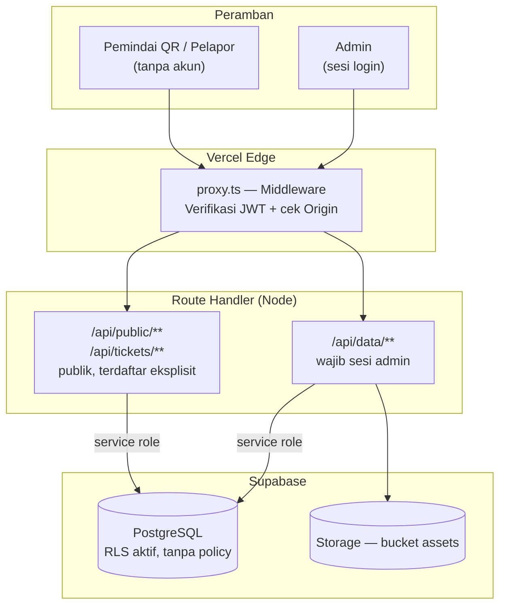
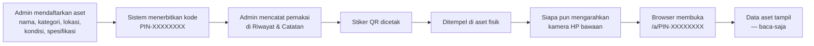
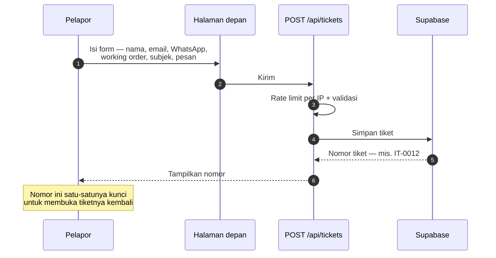
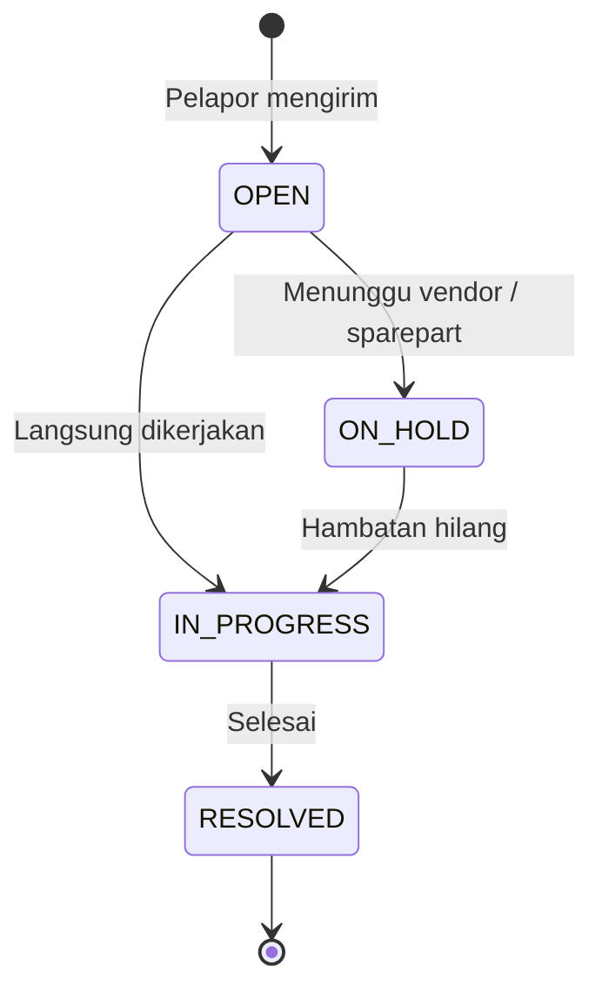
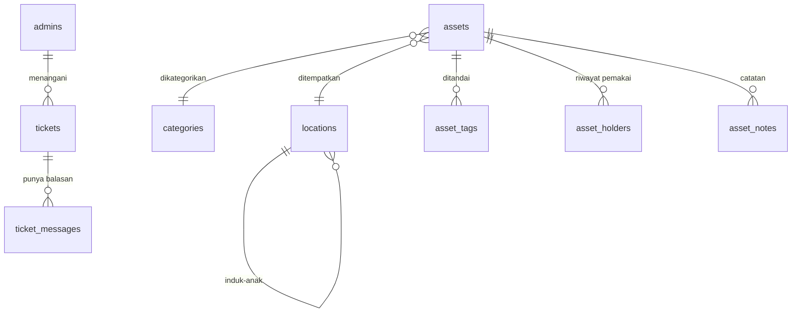

# 1. Analisis Kebutuhan & Peran

## 1.1 Identitas Proyek

| | |
| --- | --- |
| Nama sistem | **SIGAP** — Sistem Integrasi Guna Aset & Pelayanan |
| Organisasi | Garudafood |
| Jenis | Web app: registri aset ber-QR + helpdesk |
| Produksi | https://sigapgf.vercel.app |

## 1.2 Masalah di Lapangan ⭑

Dua masalah, dan keduanya bermuara pada hal yang sama: **informasi tidak ada di
tempat kejadian.**

**Aset.** Data aset hanya ada di spreadsheet yang dipegang admin. Orang yang
berdiri di depan sebuah mesin tidak punya cara tahu itu aset apa, siapa
penanggung jawabnya, dan bagaimana kondisinya — kecuali menelepon admin.

**Keluhan.** Laporan kerusakan masuk lewat WhatsApp dan obrolan lisan. Tidak ada
nomor, tidak ada status, dan pelapor tidak bisa mengecek sendiri
perkembangannya.

## 1.3 Kebutuhan yang Disepakati ⭑

| Kode | Kebutuhan | Dijawab dengan |
| --- | --- | --- |
| K-1 | Data aset bisa dibaca langsung di lokasi barangnya | Stiker QR di tiap aset → halaman publik |
| K-2 | Tahu siapa pemegang aset, sekarang dan sebelumnya | Riwayat pemakaian per aset; pemilik sekarang dihitung dari baris yang masih terbuka |
| K-3 | Orang luar tidak boleh mengubah data aset | Halaman publik baca-saja, mutasi wajib sesi admin |
| K-4 | Karyawan bisa melapor tanpa membuat akun | Form tiket publik + nomor tiket |
| K-5 | Keluhan masuk ke meja yang tepat | Working order GA / Utility / IT, antrean terpisah |
| K-6 | Data inventaris bisa diekspor | Laporan CSV / Excel / PDF, lokasi tertulis lengkap dengan induknya |

## 1.4 Peran Saya dalam Kerja Praktik ⭑

| Tahap | Yang saya kerjakan |
| --- | --- |
| Analisis | Menggali kebutuhan bersama mentor, merumuskan ulang ruang lingkup saat kebutuhan awal ternyata meleset |
| Perancangan | Skema database, alur QR, pemisahan peran, batas data publik |
| Implementasi | Seluruh kode aplikasi — halaman admin, halaman publik, API, autentikasi |
| Pengujian | Uji fungsional tiap fitur + pengujian keamanan mandiri (dua iterasi) |
| Deployment | Konfigurasi Vercel & Supabase, migrasi database, rilis ke produksi |
| Dokumentasi | PRD v2.0, panduan deployment, panduan urutan SQL |

> **Poin yang layak ditekankan:** ruang lingkup awal ternyata tidak sesuai
> kebutuhan sebenarnya, dan saya ikut dalam keputusan merombaknya — bukan hanya
> mengerjakan yang sudah ditentukan. Rinciannya di bab 6.

---

# 2. Tools & Teknologi

| Lapisan | Pilihan | Alasan |
| --- | --- | --- |
| Framework | Next.js 16 (App Router), React 19 | Satu basis kode untuk halaman dan API |
| Bahasa | TypeScript 5.9 | Kesalahan tipe tertangkap sebelum jalan |
| Styling | Tailwind CSS v4 | Konsisten dan mobile-first |
| Database | Supabase (PostgreSQL) | Gratis di tier awal, Row Level Security bawaan |
| Penyimpanan berkas | Supabase Storage | Satu penyedia dengan database |
| Autentikasi | JWT HS256 sendiri + bcrypt | Peran & working order milik SIGAP sendiri |
| Hosting | Vercel | Deploy otomatis dari `git push` |
| Alat bantu | lefthook, ESLint, Prettier, commitlint | Menjaga mutu tiap commit |

---

# 3. Perancangan Sistem

## 3.1 Arsitektur Sistem ⭑

Satu aturan yang menentukan seluruh bentuknya: **peramban tidak pernah menyentuh
database.**

## 3.2 Flowchart — Alur Aset & Kode QR ⭑

**Kenapa pemakai dicatat terpisah, bukan diketik di form aset.** Form aset
menjawab *"barang ini apa"*; itu jarang berubah. Riwayat pemakaian menjawab
*"sekarang di tangan siapa"*; itu sering berubah. Menyatukan keduanya di satu
kolom membuat jawaban lama tertimpa setiap kali yang baru diisi — dan
pertanyaan "dulu dipegang siapa" jadi tidak punya jawaban.

**Kenapa tidak perlu aplikasi pemindai.** QR code isinya cuma teks. Karena teks
itu berbentuk alamat web, kamera bawaan HP langsung menawarkan membukanya. Itu
perilaku bawaan perangkat, bukan sesuatu yang dibangun.

## 3.3 Flowchart — Alur Helpdesk ⭑

## 3.4 Siklus Status Tiket

## 3.5 ERD — Struktur Data ⭑

Sepuluh tabel. Dua aturan penting ditegakkan **database**, bukan aplikasi:

**Satu pemakai aktif per aset** — indeks unik parsial pada `asset_holders`
`WHERE to_date IS NULL`. Kalau logika program kelak keliru, hasilnya error,
bukan riwayat bercabang yang diam-diam salah.

**Username admin unik tanpa membedakan huruf besar-kecil** — indeks unik pada
`lower(username)`. Tanpa itu "Budi" dan "budi" bisa hidup berdampingan, lalu
pencarian login yang memakai `ILIKE` menemukan dua baris sekaligus dan **kedua**
admin itu sama-sama terkunci di luar.

Keduanya contoh prinsip yang sama: aturan yang tidak boleh dilanggar diletakkan
di lapisan yang tidak bisa dilewati siapa pun, bukan dititipkan ke kode
aplikasi yang bisa lupa memanggilnya.

---

# 4. Hasil & Tampilan Aplikasi ⭑

## 4.1 Screenshot yang Perlu Diambil

Ambil dalam mode **layar penuh, tema gelap**. Sensor data pribadi pelapor
(email dan nomor WhatsApp) sebelum masuk slide.

| # | Layar | Alamat | Yang harus terlihat |
| --- | --- | --- | --- |
| S-1 | Halaman depan | `/` | Form buat tiket + kartu History Ticket dengan tombol Semua/GA/Utility/IT |
| S-2 | **Halaman hasil pindai QR** | `/a/PIN-XXXXXXXX` | Kondisi, **lokasi berikut jalur induknya**, spesifikasi, dan Riwayat Pemakai — ambil aset yang riwayatnya terisi |
| S-3 | Lacak tiket | `/` → Lacak Tiket | Status tiket + balasan admin |
| S-4 | Home admin | `/dashboard` | Empat kartu kondisi + kartu Perlu Dilengkapi |
| S-5 | Daftar aset | `/assets` | Tabel aset dengan badge kondisi dan lokasi berjalur penuh |
| S-6 | Detail aset + QR | `/assets/<id>` | QR code, tombol cetak, dan kartu Riwayat & Catatan berisi beberapa baris pemakai |
| S-7 | Panel tiket admin | `/tickets` | Filter status + daftar tiket |

**Minimal 4 slide** (S-2, S-4, S-6, S-7 adalah yang paling menjelaskan). Kalau
ruang cukup, S-1 dan S-5 memperkuat.

> **S-2 adalah screenshot terpenting.** Itu satu-satunya layar yang tidak ada di
> sistem inventaris biasa.

## 4.2 Demo Langsung ⭑

Kalau memungkinkan, **demo mengalahkan screenshot.** Bawa satu stiker QR
tercetak, tempel di benda apa pun di ruangan, lalu minta penguji memindai dengan
HP-nya sendiri.

Kalimat penutup demo:

> "Yang barusan Bapak/Ibu buka itu halaman publik. Siapa pun yang memegang
> stikernya bisa membacanya, tapi tidak ada satu pun tombol untuk mengubah
> datanya."

Siapkan cadangan: rekaman layar 20 detik, untuk berjaga kalau jaringan ruangan
bermasalah.

---

# 5. Pengujian

Pengujian saya lakukan sendiri, dibagi dua: memastikan **fiturnya jalan**, lalu
memastikan **tidak bisa disalahgunakan**.

## 5.1 Menguji Fiturnya Jalan

| Yang diuji | Caranya | Hasilnya |
| --- | --- | --- |
| Stiker QR terbaca kamera HP biasa | Cetak stiker, pindai pakai HP sendiri di luar jaringan kantor | Halaman aset terbuka — tanpa aplikasi, tanpa login |
| Orang luar tidak bisa mengubah data | Cari jalur menyimpan di halaman hasil pindai | Tidak ada satu pun; halaman itu hanya bisa dibaca |
| Harga aset tidak ikut terkirim | Periksa data yang dikirim ke halaman publik | Harga dan id database tidak pernah dikirim |
| Tiket masuk ke meja yang benar | Jumlahkan isi tombol GA, Utility, dan IT, lalu bandingkan dengan tombol Semua | Jumlahnya selalu sama — tidak ada tiket yang bocor ke meja lain atau hilang |
| Tiket menggantung tidak tenggelam | Biarkan tiket lewat sehari, lihat daftarnya | Tiket selesai hilang; tiket belum selesai naik ke atas |
| Pemilik aset mengikuti riwayat pemakaian | Catat pemakai baru, lihat kolom pemilik | Pemilik berubah sendiri mengikuti riwayat |
| Lokasi tampil lengkap dengan induknya | Buka aset yang lokasinya di dalam pabrik | Tertulis "Pabrik Pati › Gudang B", bukan "Gudang B" |
| Kode tidak menyimpan error | Jalankan pemeriksa tipe, linter, dan build | Nol error pada ketiganya |

## 5.2 Menguji Tidak Bisa Disalahgunakan ⭑

Saya menguji keamanannya sendiri dalam dua putaran: pertama mencoba menyerang
sistemnya, lalu membaca ulang kodenya dan memeriksa langsung setelan database
di produksi.

**Enam masalah ditemukan dan sudah diperbaiki. Dua sisanya sengaja dibiarkan,
dan alasannya dicatat.**

| Masalah yang ditemukan | Sudah diperbaiki? |
| --- | --- |
| Pembatas percobaan login bisa dikelabui dengan memalsukan alamat pengirim | Sudah |
| Pembatas itu justru melambat sendiri saat dibanjiri permintaan | Sudah |
| Lampiran tiket tidak pernah dihapus — penyimpanan hanya bertambah | Sudah |
| Ganti username yang gagal tersimpan tetap dijawab "berhasil" | Sudah |
| Dua akun dengan huruf besar-kecil berbeda saling mengunci | Sudah |
| Satu tombol bisa menghapus seluruh tiket di database | Sudah |
| Isi tiket bisa dibuka orang lain lewat nomor yang berurutan | Sengaja, dicatat |
| Tabel baru di database lahir dalam keadaan terbuka | Belum, butuh akses SQL produksi |

### Satu temuan yang paling layak diceritakan

**Sistem yang berbohong tentang kegagalannya.**

Saat admin mengganti username, penyimpanan ke database bisa saja gagal. Yang
terjadi dulu: sistem tetap menjawab **"Profil tersimpan"**, padahal tidak.
Akibatnya berurutan:

1. Admin melihat pesan berhasil
2. Beberapa saat kemudian dia terlempar keluar sendiri
3. Nama barunya tidak bisa dipakai masuk — karena tidak pernah tersimpan
4. Satu-satunya jalan masuk adalah mengingat nama lamanya

Ini jenis kesalahan yang paling mahal: bukan karena akibatnya besar, tapi
karena **sistemnya memberi tahu hal yang salah.** Kalau ia jujur bilang gagal,
admin tinggal mengulang. Karena ia bilang berhasil, admin justru terkunci.

Perbaikannya: kegagalan menyimpan sekarang selalu sampai ke admin, dan setelah
username berhasil diganti, nama barunya ditampilkan besar-besar dan tidak
hilang sendiri.

> **Poin yang layak ditekankan:** temuan ini tidak datang dari laporan bug.
> Belum ada yang mengeluh, karena belum ada admin lain yang memakainya. Saya
> menemukannya dengan bertanya *"apa yang terjadi kalau ini gagal?"* —
> pertanyaan yang tidak akan pernah terjawab kalau saya hanya menguji jalur
> yang normal.

### Kenapa dua temuan sengaja dibiarkan terbuka

Menyajikan yang belum ditutup lengkap dengan alasannya lebih jujur daripada
mengklaim semuanya beres.

**Isi tiket bisa dibuka lewat nomor berurutan.** Ini bukan kelalaian, tapi
akibat keputusan produk: riwayat tiket sengaja bisa dibuka tanpa akun supaya
pelapor tidak kehilangan jejaknya saat berganti perangkat. Menutupnya berarti
mengubah keputusan itu — dan itu wewenang pemilik produk, bukan pengembang.

**Tabel baru lahir terbuka.** Perbaikannya satu baris perintah SQL, tapi harus
dijalankan langsung di database produksi. Perintahnya sudah saya siapkan.

---

# 6. Kendala & Solusi ⭑

| # | Kendala | Solusi |
| --- | --- | --- |
| 1 | **Ruang lingkup awal meleset.** Sistem dibangun sebagai aplikasi peminjaman lengkap dengan booking, kalender, keterlambatan, audit fisik, kit, dan model aset. Setelah dipakai, ternyata kebutuhan sebenarnya hanya: tahu ini aset apa dan siapa pemegangnya. | Enam modul dihapus — lebih dari 3.500 baris kode. Kode yang tidak dipakai tetap harus diuji, diperbaiki, dan dipahami pembaca berikutnya. |
| 2 | **Stiker QR bisa mati permanen.** Alamat di dalam QR semula diambil dari peramban yang sedang membukanya, jadi stiker yang dicetak saat pengembangan berisi `localhost`. Kegagalannya senyap — QR-nya terlihat normal dan tetap terpindai. | Alamat dipaksa dari konfigurasi produksi, bukan dari peramban. Ketahuan sebelum ada stiker yang dicetak massal. |
| 3 | **Tampilan rusak hanya di perangkat tertentu.** Di komputer bermode terang, kolom input login menjadi putih di atas putih — kontras 1,04:1, praktis tidak terbaca. Tidak pernah terlihat di perangkat yang mode gelap. | Akarnya satu: varian `dark:` Tailwind mengikuti setelan sistem, padahal aplikasi memaksa tema gelap. Diperbaiki dengan satu baris CSS; empat keluhan tampilan selesai sekaligus. |
| 4 | **Ada bug yang tidak kelihatan dari membaca kode.** Pembatas percobaan login terlihat baik-baik saja saat kodenya dibaca, padahal justru melambat sendiri ketika dibanjiri permintaan. | Baru ketahuan setelah diuji dengan puluhan ribu permintaan sekaligus. Sejak itu pengujian beban jadi bagian dari cara kerja saya, bukan pelengkap. |
| 5 | **Perbaikan yang ter-deploy tapi tidak berfungsi.** Pembersih lampiran otomatis sudah ada di kode, tapi tidak pernah berhasil jalan karena variabel rahasianya terpasang di project Vercel yang salah. | Kodenya benar, konfigurasinya tidak — dan tidak ada pesan error yang memberi tahu. Konfigurasi ikut diverifikasi, bukan diasumsikan. |
| 6 | **Sistem yang melaporkan keberhasilan palsu.** Ganti username yang gagal disimpan tetap dijawab "berhasil", lalu mengunci admin di luar. Tidak terlihat sama sekali dari pemakaian normal. | Ditemukan dengan menguji jalur gagal, bukan jalur normal. Kegagalan simpan kini selalu dilaporkan, dan aturan unik ditegakkan sampai ke level indeks database. |
| 7 | **Tidak ada migration runner.** Perubahan skema database dijalankan manual, rawan terlewat atau salah urutan. | Berkas SQL diberi nomor urut dan panduan tertulis. Skrip yang tidak berlaku untuk instalasi baru diberi penjaga agar tidak menggagalkan rantai setup. |

---

## Lampiran A — Usulan Susunan Slide

| # | Judul slide | Sumber |
| --- | --- | --- |
| 1 | Judul & identitas | § 1.1 |
| 2 | Latar belakang — dua masalah | § 1.2 |
| 3 | Kebutuhan yang disepakati | § 1.3 |
| 4 | **Peran saya dalam KP** | § 1.4 |
| 5 | Tools & teknologi | § 2 |
| 6 | Arsitektur sistem | § 3.1 (diagram) |
| 7 | Flowchart alur aset & QR | § 3.2 (diagram) |
| 8 | Flowchart alur helpdesk | § 3.3 (diagram) |
| 9 | Siklus status tiket | § 3.4 (diagram) |
| 10 | ERD | § 3.5 (diagram) |
| 11 | **Demo / tampilan — hasil pindai QR** | S-2 |
| 12 | Tampilan — home admin | S-4 |
| 13 | Tampilan — detail aset & QR | S-6 |
| 14 | Tampilan — panel tiket | S-7 |
| 15 | Pengujian fitur | § 5.1 |
| 16 | Pengujian keamanan — daftar temuan | § 5.2 |
| 17 | **Cerita satu temuan: sistem yang bilang berhasil padahal gagal** | § 5.2 |
| 18 | Kendala & solusi | § 6 |

Kalau waktunya mepet, yang paling aman dipotong: slide 9 dan 13.

Slide 17 jangan dipotong — itu slide di mana kamu bercerita, bukan membaca
tabel, dan biasanya justru yang paling diingat penguji.

---

## Lampiran B — Antisipasi Pertanyaan Penguji

**"Apa persisnya kontribusi Anda?"**
Seluruh kode aplikasi, skema database, pengujian, dan deployment. Termasuk ikut
memutuskan perombakan ruang lingkup saat kebutuhan awal ternyata meleset —
bukan hanya mengerjakan spesifikasi yang sudah jadi.

**"Kenapa QR-nya tidak pakai aplikasi pemindai sendiri?"**
Karena tidak perlu. QR berisi URL, dan kamera bawaan HP sudah membukanya.
Pemindai sendiri justru menuntut orang membuka web dan login lebih dulu —
kebalikan dari yang dibutuhkan orang yang sedang berdiri di depan asetnya.

**"Kalau siapa pun bisa memindai, apa datanya tidak bocor?"**
Yang bisa dibaca hanya aset yang stikernya dipegang. Harga aset dan id database
tidak pernah dikirim ke sana, halaman tidak ditaut dari mana pun, dan diberi
`noindex`. Konsekuensinya diterima secara sadar dan dicatat di PRD.

**"Kenapa tidak pakai Supabase Auth saja?"**
Peran ASSET/HELPDESK dan working order adalah konsep milik SIGAP. Sesi buatan
sendiri membuat pencabutan peran berlaku seketika lewat `token_version`.

**"Kalau kunci Supabase bocor dari browser, bagaimana?"**
Kunci itu memang publik. Nilainya nol: RLS aktif di seluruh tabel tanpa satu pun
policy. Sudah diverifikasi langsung ke database produksi.

**"Kenapa ada modul yang dihapus?"**
Peminjaman, kit, audit, dan model aset tidak dipakai setelah dibangun.
Menghapus fitur mati adalah keputusan rekayasa, bukan kemunduran.

**"Kenapa masih ada temuan keamanan yang terbuka?"**
Bukan kelalaian. Yang pertama menyangkut apa yang boleh dilihat publik — itu
keputusan pemilik produk, bukan pengembang. Yang kedua perbaikannya satu baris
SQL yang harus dijalankan langsung di database produksi. Keduanya sudah punya
rekomendasi yang siap dipakai.

**"Kenapa pemilik aset tidak diketik langsung saja? Bukankah lebih cepat?"**
Lebih cepat, tapi jawabannya cuma bertahan sampai pemiliknya berganti. Kolom
yang diketik akan tertimpa, dan pertanyaan "dulu dipegang siapa" jadi tidak
punya jawaban. Dengan riwayat, jawaban lama tetap ada dan pemilik sekarang
dihitung dari baris yang masih terbuka. Kolom `owner` di database tetap ada
sebagai cerminan, tapi sengaja dikeluarkan dari allowlist tulis — supaya tidak
ada dua tempat yang bisa menentukan satu fakta.

**"Mencatat siapa memakai aset — bukankah itu sistem peminjaman lagi?"**
Tidak, dan bedanya struktural. Tidak ada tanggal kembali yang ditunggu sistem,
tidak ada status terlambat, tidak ada permintaan dari pengguna, dan halaman
publik tidak punya satu pun endpoint untuk memulainya. Pencatatannya dilakukan
admin **setelah** perpindahan terjadi. Analoginya BPKB kendaraan: mobil selalu
ada pemiliknya dan pergantiannya tercatat — itu catatan kepemilikan, bukan
rental.

**"Kenapa lokasi ditulis berjenjang?"**
Karena nama ruangan berulang antar pabrik. "Gudang B" bisa ada di Pati maupun
Sumedang, dan orang yang memindai stiker perlu tahu yang mana. Jalur lengkapnya
tampil di halaman hasil pindai sekaligus di setiap tempat admin memilih lokasi —
kalau hanya halaman publiknya yang rapi, yang salah justru titik pengisiannya.

**"Bagaimana memastikan sistem ini aman?"**
Tidak ada sistem yang bisa dinyatakan aman secara mutlak. Yang bisa disampaikan:
enam temuan ditutup dan diverifikasi, dua didokumentasikan terbuka lengkap
dengan rekomendasinya. Dua di antara yang ditutup baru ditemukan pada iterasi
terakhir, dengan menguji apa yang terjadi ketika penyimpanan **gagal** — bukan
ketika berhasil.
