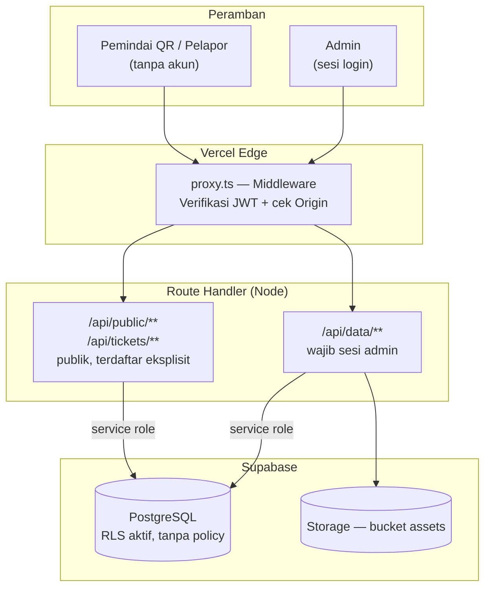
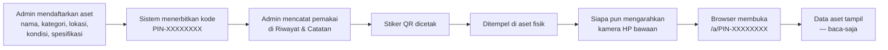
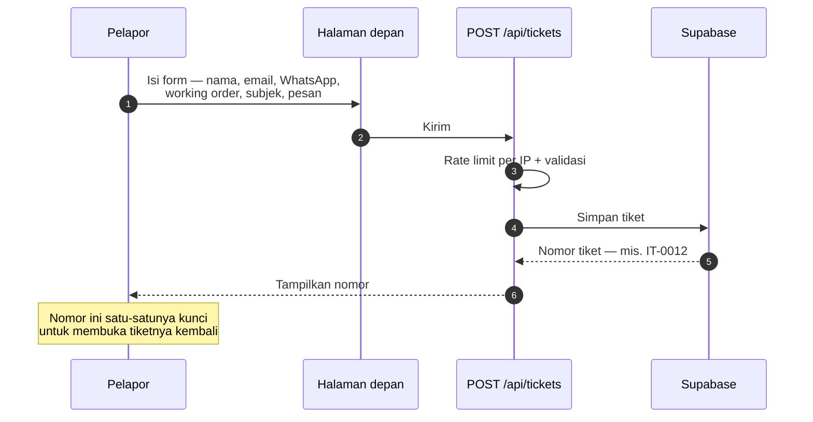
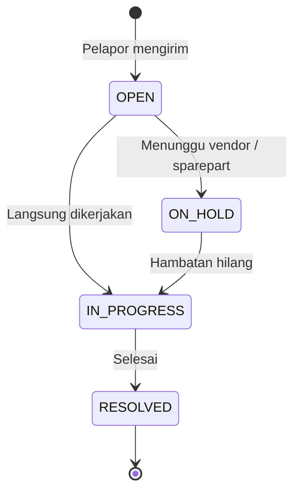
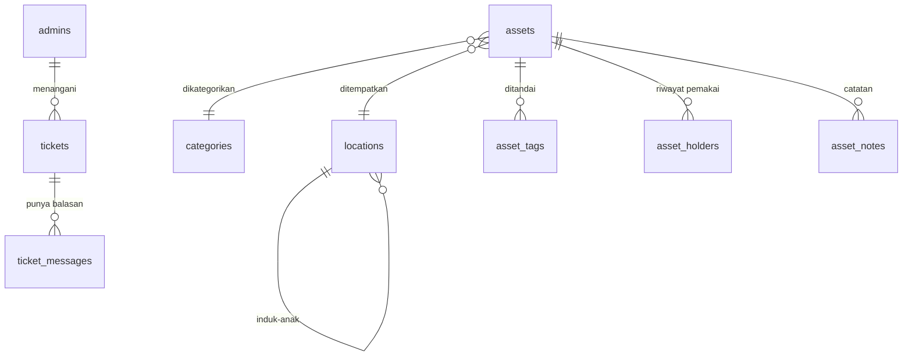

# 1. Analisis Kebutuhan & Peran

## 1.1 Identitas Proyek

| | |
| --- | --- |
| Nama sistem | **SIGAP** — Sistem Integrasi Guna Aset & Pelayanan |
| Organisasi | Garudafood |
| Jenis | Web app: registri aset ber-QR + helpdesk |
| Produksi | https://sigapgf.vercel.app |

## 1.2 Masalah di Lapangan ⭑

Dua masalah, dan keduanya bermuara pada hal yang sama: **informasi tidak ada di
tempat kejadian.**

**Aset.** Data aset hanya ada di spreadsheet yang dipegang admin. Orang yang
berdiri di depan sebuah mesin tidak punya cara tahu itu aset apa, siapa
penanggung jawabnya, dan bagaimana kondisinya — kecuali menelepon admin.

**Keluhan.** Laporan kerusakan masuk lewat WhatsApp dan obrolan lisan. Tidak ada
nomor, tidak ada status, dan pelapor tidak bisa mengecek sendiri
perkembangannya.

## 1.3 Kebutuhan yang Disepakati ⭑

| Kode | Kebutuhan | Dijawab dengan |
| --- | --- | --- |
| K-1 | Data aset bisa dibaca langsung di lokasi barangnya | Stiker QR di tiap aset → halaman publik |
| K-2 | Tahu siapa pemegang aset, sekarang dan sebelumnya | Riwayat pemakaian per aset; pemilik sekarang dihitung dari baris yang masih terbuka |
| K-3 | Orang luar tidak boleh mengubah data aset | Halaman publik baca-saja, mutasi wajib sesi admin |
| K-4 | Karyawan bisa melapor tanpa membuat akun | Form tiket publik + nomor tiket |
| K-5 | Keluhan masuk ke meja yang tepat | Working order GA / Utility / IT, antrean terpisah |
| K-6 | Data inventaris bisa diekspor | Laporan CSV / Excel / PDF, lokasi tertulis lengkap dengan induknya |

## 1.4 Peran Saya dalam Kerja Praktik ⭑

| Tahap | Yang saya kerjakan |
| --- | --- |
| Analisis | Menggali kebutuhan bersama mentor, merumuskan ulang ruang lingkup saat kebutuhan awal ternyata meleset |
| Perancangan | Skema database, alur QR, pemisahan peran, batas data publik |
| Implementasi | Seluruh kode aplikasi — halaman admin, halaman publik, API, autentikasi |
| Pengujian | Uji fungsional tiap fitur + pengujian keamanan mandiri (dua iterasi) |
| Deployment | Konfigurasi Vercel & Supabase, migrasi database, rilis ke produksi |
| Dokumentasi | PRD v2.0, panduan deployment, panduan urutan SQL |

> **Poin yang layak ditekankan:** ruang lingkup awal ternyata tidak sesuai
> kebutuhan sebenarnya, dan saya ikut dalam keputusan merombaknya — bukan hanya
> mengerjakan yang sudah ditentukan. Rinciannya di bab 6.

---

# 2. Tools & Teknologi

| Lapisan | Pilihan | Alasan |
| --- | --- | --- |
| Framework | Next.js 16 (App Router), React 19 | Satu basis kode untuk halaman dan API |
| Bahasa | TypeScript 5.9 | Kesalahan tipe tertangkap sebelum jalan |
| Styling | Tailwind CSS v4 | Konsisten dan mobile-first |
| Database | Supabase (PostgreSQL) | Gratis di tier awal, Row Level Security bawaan |
| Penyimpanan berkas | Supabase Storage | Satu penyedia dengan database |
| Autentikasi | JWT HS256 sendiri + bcrypt | Peran & working order milik SIGAP sendiri |
| Hosting | Vercel | Deploy otomatis dari `git push` |
| Alat bantu | lefthook, ESLint, Prettier, commitlint | Menjaga mutu tiap commit |

---

# 3. Perancangan Sistem

## 3.1 Arsitektur Sistem ⭑

Satu aturan yang menentukan seluruh bentuknya: **peramban tidak pernah menyentuh
database.**

## 3.2 Flowchart — Alur Aset & Kode QR ⭑

**Kenapa pemakai dicatat terpisah, bukan diketik di form aset.** Form aset
menjawab *"barang ini apa"*; itu jarang berubah. Riwayat pemakaian menjawab
*"sekarang di tangan siapa"*; itu sering berubah. Menyatukan keduanya di satu
kolom membuat jawaban lama tertimpa setiap kali yang baru diisi — dan
pertanyaan "dulu dipegang siapa" jadi tidak punya jawaban.

**Kenapa tidak perlu aplikasi pemindai.** QR code isinya cuma teks. Karena teks
itu berbentuk alamat web, kamera bawaan HP langsung menawarkan membukanya. Itu
perilaku bawaan perangkat, bukan sesuatu yang dibangun.

## 3.3 Flowchart — Alur Helpdesk ⭑

## 3.4 Siklus Status Tiket

## 3.5 ERD — Struktur Data ⭑

Sepuluh tabel. Dua aturan penting ditegakkan **database**, bukan aplikasi:

**Satu pemakai aktif per aset** — indeks unik parsial pada `asset_holders`
`WHERE to_date IS NULL`. Kalau logika program kelak keliru, hasilnya error,
bukan riwayat bercabang yang diam-diam salah.

**Username admin unik tanpa membedakan huruf besar-kecil** — indeks unik pada
`lower(username)`. Tanpa itu "Budi" dan "budi" bisa hidup berdampingan, lalu
pencarian login yang memakai `ILIKE` menemukan dua baris sekaligus dan **kedua**
admin itu sama-sama terkunci di luar.

Keduanya contoh prinsip yang sama: aturan yang tidak boleh dilanggar diletakkan
di lapisan yang tidak bisa dilewati siapa pun, bukan dititipkan ke kode
aplikasi yang bisa lupa memanggilnya.

---

# 4. Hasil & Tampilan Aplikasi ⭑

## 4.1 Screenshot yang Perlu Diambil

Ambil dalam mode **layar penuh, tema gelap**. Sensor data pribadi pelapor
(email dan nomor WhatsApp) sebelum masuk slide.

| # | Layar | Alamat | Yang harus terlihat |
| --- | --- | --- | --- |
| S-1 | Halaman depan | `/` | Form buat tiket + kartu History Ticket dengan tombol Semua/GA/Utility/IT |
| S-2 | **Halaman hasil pindai QR** | `/a/PIN-XXXXXXXX` | Kondisi, **lokasi berikut jalur induknya**, spesifikasi, dan Riwayat Pemakai — ambil aset yang riwayatnya terisi |
| S-3 | Lacak tiket | `/` → Lacak Tiket | Status tiket + balasan admin |
| S-4 | Home admin | `/dashboard` | Empat kartu kondisi + kartu Perlu Dilengkapi |
| S-5 | Daftar aset | `/assets` | Tabel aset dengan badge kondisi dan lokasi berjalur penuh |
| S-6 | Detail aset + QR | `/assets/<id>` | QR code, tombol cetak, dan kartu Riwayat & Catatan berisi beberapa baris pemakai |
| S-7 | Panel tiket admin | `/tickets` | Filter status + daftar tiket |

**Minimal 4 slide** (S-2, S-4, S-6, S-7 adalah yang paling menjelaskan). Kalau
ruang cukup, S-1 dan S-5 memperkuat.

> **S-2 adalah screenshot terpenting.** Itu satu-satunya layar yang tidak ada di
> sistem inventaris biasa.

## 4.2 Demo Langsung ⭑

Kalau memungkinkan, **demo mengalahkan screenshot.** Bawa satu stiker QR
tercetak, tempel di benda apa pun di ruangan, lalu minta penguji memindai dengan
HP-nya sendiri.

Kalimat penutup demo:

> "Yang barusan Bapak/Ibu buka itu halaman publik. Siapa pun yang memegang
> stikernya bisa membacanya, tapi tidak ada satu pun tombol untuk mengubah
> datanya."

Siapkan cadangan: rekaman layar 20 detik, untuk berjaga kalau jaringan ruangan
bermasalah.

---

# 5. Pengujian

## 5.1 Pengujian Fungsional

| # | Skenario | Cara uji | Hasil |
| --- | --- | --- | --- |
| U-1 | QR terpindai kamera HP bawaan | Cetak stiker, pindai dengan HP di luar jaringan kantor | Halaman aset terbuka tanpa login |
| U-2 | Halaman publik benar-benar baca-saja | Periksa route: tidak ada handler POST/PATCH/DELETE | Tidak ada jalur mengubah data |
| U-3 | Harga aset tidak bocor ke publik | Periksa kunci pada respons `/api/public/asset/<kode>` | `value` dan `id` tidak ada di respons |
| U-4 | Halaman aset tidak terindeks | Periksa HTML yang dikirim server | Penanda `noindex` ada |
| U-5 | Filter tiket per meja | Bandingkan hitungan tiap tombol | Semua 9 = GA 2 + Utility 4 + IT 3 |
| U-6 | Daftar tiket publik dibatasi 1 hari, tapi tiket belum selesai bertahan | Bandingkan umur & status tiket dengan yang tampil | Tiket Selesai >1 hari hilang; tiket Open lama tetap tampil di puncak |
| U-7 | Pemilik aset mengikuti riwayat | Catat pemakai baru, periksa kolom `owner` | Baris lama tertutup, baris baru terbuka, `owner` ikut berubah |
| U-9 | Kolom `owner` tidak bisa ditulis lewat API | Kirim `owner` pada PATCH aset | Diabaikan allowlist — hanya riwayat yang bisa mengubahnya |
| U-10 | Username bentrok ditolak | `PUT /api/auth/me` dengan nama admin lain berbeda kapitalisasi | `409 usernameTaken`, tabel `admins` tidak berubah |
| U-11 | Jalur lokasi tahan siklus | Susun induk yang saling menunjuk | Rantai dipotong, halaman tetap terbuka |
| U-8 | Mutu kode | `tsc --noEmit`, ESLint, `next build` | Nol error pada ketiganya |

## 5.2 Pengujian Keamanan ⭑

Dilakukan mandiri dalam dua iterasi: pentest white-box, lalu review kode dan
verifikasi konfigurasi langsung di produksi.

| Kode | Tingkat | Temuan | Status |
| --- | --- | --- | --- |
| SIGAP-01 | Sedang | `X-Forwarded-For` bisa dipalsukan untuk mereset kuota rate limit | **Ditutup** |
| DDOS-01 | Tinggi | Rate limiter jadi bottleneck-nya sendiri saat dibanjiri | **Ditutup** |
| DDOS-02 | Tinggi | Lampiran tiket tidak pernah dihapus — bucket hanya bertambah | **Ditutup** |
| DDOS-03 | Sedang | Endpoint publik dipaksa tidak bisa di-cache | **Ditutup** |
| SIGAP-02 | Tinggi | Isi tiket terbaca publik lewat nomor berurutan | Terbuka |
| SIGAP-03 | Sedang | Tabel baru otomatis terbuka untuk anon | Terbuka |
| AUTH-01 | **Tinggi** | Ganti username yang gagal disimpan tetap dijawab "berhasil", lalu admin terkunci di luar | **Ditutup** |
| AUTH-02 | **Tinggi** | Dua akun berbeda kapitalisasi mengunci keduanya dari login | **Ditutup** |

### DDOS-01 — slide dengan angka paling kuat

Pembersih rate limiter menyapu seluruh memori pada **setiap** permintaan begitu
ukurannya lewat 500. Saat dibanjiri dari banyak alamat, entri belum kedaluwarsa
sehingga sapuan tidak menghapus apa pun — memori terus tumbuh dan tiap
permintaan membayar sapuan yang makin panjang. **Pertahanannya melemah justru
ketika paling dibutuhkan.**

| Alamat IP unik | Sebelum | Sesudah | Peningkatan |
| --- | --- | --- | --- |
| 20.000 | 755 ms | 3 ms | **252×** |
| 60.000 | 6.129 ms | 16 ms | **383×** |

Yang lama tumbuh **kuadratik**; yang baru tumbuh linear.

### AUTH-01 — kegagalan yang menyamar jadi keberhasilan

Ditemukan saat memeriksa apakah fitur ganti password dan username siap dipegang
admin sungguhan. Ini jenis bug yang paling mahal: **bukan karena akibatnya
besar, tapi karena sistem berbohong tentangnya.**

Penyimpanan profil hanya mencatat kegagalan ke log, lalu tetap menjawab
`{ok: true}` — **dan menerbitkan ulang cookie sesi memakai username baru**.
Kalau tulisannya gagal, database masih memegang nama lama sementara cookie
menunjuk nama yang tidak pernah ada. Urutannya:

1. Admin melihat pesan "Profil tersimpan"
2. Permintaan berikutnya menendangnya keluar
3. Nama barunya tidak bisa dipakai login — karena tidak pernah masuk database
4. Satu-satunya jalan masuk adalah mengingat nama lamanya

Pola yang sama ada di ganti password: "berhasil", padahal passwordnya tidak
pernah berubah.

**Perbaikannya tiga lapis.** Kegagalan simpan kini sampai ke admin; cache profil
baru diisi setelah tulisan berhasil, bukan sebelumnya; dan username bentrok
ditolak lebih dulu dengan pesan yang bisa dibaca. Diverifikasi dengan permintaan
sungguhan ke API — `409 usernameTaken`, dan tabel `admins` tidak berubah.

> **Poin yang layak ditekankan:** pengujian ini tidak dipicu laporan bug. Tidak
> ada yang mengeluh, karena belum ada admin sungguhan yang mencoba. Bug ini
> ditemukan dengan bertanya *"apa yang terjadi kalau ini gagal?"* — pertanyaan
> yang tidak akan pernah dijawab oleh pengujian jalur normal.

### Temuan yang sengaja dibiarkan terbuka

Menyajikan yang belum ditutup lengkap dengan alasannya lebih kuat daripada
mengklaim semuanya beres.

**SIGAP-02** bukan bug, melainkan konsekuensi keputusan produk: riwayat tiket
sengaja bisa dibuka tanpa akun supaya pelapor tidak kehilangan jejaknya saat
berganti perangkat. Menutupnya berarti mengubah keputusan itu — wewenang pemilik
produk, bukan pengembang.

---

# 6. Kendala & Solusi ⭑

| # | Kendala | Solusi |
| --- | --- | --- |
| 1 | **Ruang lingkup awal meleset.** Sistem dibangun sebagai aplikasi peminjaman lengkap dengan booking, kalender, keterlambatan, audit fisik, kit, dan model aset. Setelah dipakai, ternyata kebutuhan sebenarnya hanya: tahu ini aset apa dan siapa pemegangnya. | Enam modul dihapus — lebih dari 3.500 baris kode. Kode yang tidak dipakai tetap harus diuji, diperbaiki, dan dipahami pembaca berikutnya. |
| 2 | **Stiker QR bisa mati permanen.** Alamat di dalam QR semula diambil dari peramban yang sedang membukanya, jadi stiker yang dicetak saat pengembangan berisi `localhost`. Kegagalannya senyap — QR-nya terlihat normal dan tetap terpindai. | Alamat dipaksa dari konfigurasi produksi, bukan dari peramban. Ketahuan sebelum ada stiker yang dicetak massal. |
| 3 | **Tampilan rusak hanya di perangkat tertentu.** Di komputer bermode terang, kolom input login menjadi putih di atas putih — kontras 1,04:1, praktis tidak terbaca. Tidak pernah terlihat di perangkat yang mode gelap. | Akarnya satu: varian `dark:` Tailwind mengikuti setelan sistem, padahal aplikasi memaksa tema gelap. Diperbaiki dengan satu baris CSS; empat keluhan tampilan selesai sekaligus. |
| 4 | **Bug yang tidak terlihat dari membaca kode.** Kelemahan rate limiter tidak tampak saat kodenya dibaca. | Baru muncul setelah diukur di bawah beban dengan puluhan ribu alamat. Pengujian beban jadi bagian metodologi, bukan pelengkap. |
| 5 | **Perbaikan yang ter-deploy tapi tidak berfungsi.** Pembersih lampiran otomatis sudah ada di kode, tapi tidak pernah berhasil jalan karena variabel rahasianya terpasang di project Vercel yang salah. | Kodenya benar, konfigurasinya tidak — dan tidak ada pesan error yang memberi tahu. Konfigurasi ikut diverifikasi, bukan diasumsikan. |
| 6 | **Sistem yang melaporkan keberhasilan palsu.** Ganti username yang gagal disimpan tetap dijawab "berhasil", lalu mengunci admin di luar. Tidak terlihat sama sekali dari pemakaian normal. | Ditemukan dengan menguji jalur gagal, bukan jalur normal. Kegagalan simpan kini selalu dilaporkan, dan aturan unik ditegakkan sampai ke level indeks database. |
| 7 | **Tidak ada migration runner.** Perubahan skema database dijalankan manual, rawan terlewat atau salah urutan. | Berkas SQL diberi nomor urut dan panduan tertulis. Skrip yang tidak berlaku untuk instalasi baru diberi penjaga agar tidak menggagalkan rantai setup. |

---

## Lampiran A — Usulan Susunan Slide

| # | Judul slide | Sumber |
| --- | --- | --- |
| 1 | Judul & identitas | § 1.1 |
| 2 | Latar belakang — dua masalah | § 1.2 |
| 3 | Kebutuhan yang disepakati | § 1.3 |
| 4 | **Peran saya dalam KP** | § 1.4 |
| 5 | Tools & teknologi | § 2 |
| 6 | Arsitektur sistem | § 3.1 (diagram) |
| 7 | Flowchart alur aset & QR | § 3.2 (diagram) |
| 8 | Flowchart alur helpdesk | § 3.3 (diagram) |
| 9 | Siklus status tiket | § 3.4 (diagram) |
| 10 | ERD | § 3.5 (diagram) |
| 11 | **Demo / tampilan — hasil pindai QR** | S-2 |
| 12 | Tampilan — home admin | S-4 |
| 13 | Tampilan — detail aset & QR | S-6 |
| 14 | Tampilan — panel tiket | S-7 |
| 15 | Pengujian fungsional | § 5.1 |
| 16 | Pengujian keamanan — temuan | § 5.2 |
| 16b | **AUTH-01 — kegagalan yang menyamar jadi keberhasilan** | § 5.2 |
| 17 | Angka rate limiter | § 5.2 |
| 18 | Kendala & solusi | § 6 |

Kalau waktunya mepet, yang paling aman dipotong: slide 9, 13, 17.

---

## Lampiran B — Antisipasi Pertanyaan Penguji

**"Apa persisnya kontribusi Anda?"**
Seluruh kode aplikasi, skema database, pengujian, dan deployment. Termasuk ikut
memutuskan perombakan ruang lingkup saat kebutuhan awal ternyata meleset —
bukan hanya mengerjakan spesifikasi yang sudah jadi.

**"Kenapa QR-nya tidak pakai aplikasi pemindai sendiri?"**
Karena tidak perlu. QR berisi URL, dan kamera bawaan HP sudah membukanya.
Pemindai sendiri justru menuntut orang membuka web dan login lebih dulu —
kebalikan dari yang dibutuhkan orang yang sedang berdiri di depan asetnya.

**"Kalau siapa pun bisa memindai, apa datanya tidak bocor?"**
Yang bisa dibaca hanya aset yang stikernya dipegang. Harga aset dan id database
tidak pernah dikirim ke sana, halaman tidak ditaut dari mana pun, dan diberi
`noindex`. Konsekuensinya diterima secara sadar dan dicatat di PRD.

**"Kenapa tidak pakai Supabase Auth saja?"**
Peran ASSET/HELPDESK dan working order adalah konsep milik SIGAP. Sesi buatan
sendiri membuat pencabutan peran berlaku seketika lewat `token_version`.

**"Kalau kunci Supabase bocor dari browser, bagaimana?"**
Kunci itu memang publik. Nilainya nol: RLS aktif di seluruh tabel tanpa satu pun
policy. Sudah diverifikasi langsung ke database produksi.

**"Kenapa ada modul yang dihapus?"**
Peminjaman, kit, audit, dan model aset tidak dipakai setelah dibangun.
Menghapus fitur mati adalah keputusan rekayasa, bukan kemunduran.

**"Kenapa masih ada temuan keamanan yang terbuka?"**
Bukan kelalaian. SIGAP-02 menuntut keputusan pemilik produk karena menyangkut
apa yang boleh publik; SIGAP-03 butuh akses SQL Editor produksi. Keduanya sudah
punya rekomendasi konkret.

**"Kenapa pemilik aset tidak diketik langsung saja? Bukankah lebih cepat?"**
Lebih cepat, tapi jawabannya cuma bertahan sampai pemiliknya berganti. Kolom
yang diketik akan tertimpa, dan pertanyaan "dulu dipegang siapa" jadi tidak
punya jawaban. Dengan riwayat, jawaban lama tetap ada dan pemilik sekarang
dihitung dari baris yang masih terbuka. Kolom `owner` di database tetap ada
sebagai cerminan, tapi sengaja dikeluarkan dari allowlist tulis — supaya tidak
ada dua tempat yang bisa menentukan satu fakta.

**"Mencatat siapa memakai aset — bukankah itu sistem peminjaman lagi?"**
Tidak, dan bedanya struktural. Tidak ada tanggal kembali yang ditunggu sistem,
tidak ada status terlambat, tidak ada permintaan dari pengguna, dan halaman
publik tidak punya satu pun endpoint untuk memulainya. Pencatatannya dilakukan
admin **setelah** perpindahan terjadi. Analoginya BPKB kendaraan: mobil selalu
ada pemiliknya dan pergantiannya tercatat — itu catatan kepemilikan, bukan
rental.

**"Kenapa lokasi ditulis berjenjang?"**
Karena nama ruangan berulang antar pabrik. "Gudang B" bisa ada di Pati maupun
Sumedang, dan orang yang memindai stiker perlu tahu yang mana. Jalur lengkapnya
tampil di halaman hasil pindai sekaligus di setiap tempat admin memilih lokasi —
kalau hanya halaman publiknya yang rapi, yang salah justru titik pengisiannya.

**"Bagaimana memastikan sistem ini aman?"**
Tidak ada sistem yang bisa dinyatakan aman secara mutlak. Yang bisa disampaikan:
enam temuan ditutup dan diverifikasi, dua didokumentasikan terbuka lengkap
dengan rekomendasinya. Dua di antara yang ditutup baru ditemukan pada iterasi
terakhir, dengan menguji apa yang terjadi ketika penyimpanan **gagal** — bukan
ketika berhasil.
