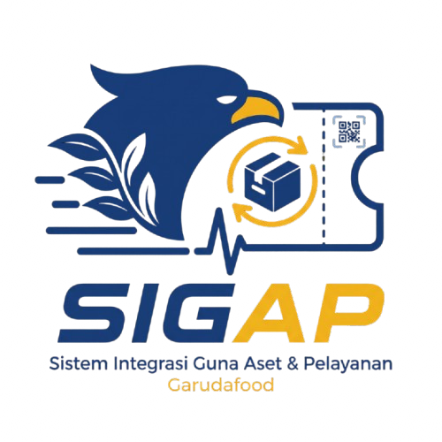

<p align="center">
  
</p>

<h1 align="center">SIGAP</h1>

<p align="center">
  <b>Sistem Integrasi Guna Aset &amp; Pelayanan</b> — Garudafood<br />
  <a href="https://sigapgf.vercel.app">sigapgf.vercel.app</a>
</p>

---

Aplikasi web internal Garudafood untuk dua pekerjaan: **mencatat aset ber-QR**
dan **melayani keluhan karyawan lewat tiket helpdesk**.

> **Baca ini dulu.** Repo ini fork dari [shelf.nu](https://github.com/Shelf-nu/shelf.nu).
> Kode SIGAP **hanya** ada di folder [`apps/pinjamin`](apps/pinjamin). Folder
> lain (`apps/webapp`, `apps/companion`, `apps/docs`, `packages/`, `tooling/`)
> adalah kode bawaan shelf.nu yang tidak dipakai SIGAP — begitu juga
> `AGENTS.md`, `CONTRIBUTING.md`, dan `CODE_OF_CONDUCT.md`, yang membahas
> shelf.nu, bukan SIGAP.

## Fitur

**Manajemen aset** — admin peran `ASSET`

- Registri aset lengkap dengan kategori, tag, lokasi berjenjang, foto, dan
  riwayat pemakai.
- Stiker QR berkode `PIN-…` yang bisa dipindai kamera HP siapa pun untuk
  membuka halaman data aset (baca-saja, tanpa login).
- Dasbor kondisi aset (Baik, Rusak, Dalam Perbaikan) dan daftar aset yang
  datanya belum lengkap.
- Laporan yang bisa diekspor ke CSV dan Excel: ringkasan, per kategori, per
  lokasi, dan daftar aset.

**Helpdesk tiket** — admin peran `HELPDESK`, satu admin per meja (GA, Utility, IT)

- Karyawan membuat tiket dari halaman depan tanpa login. Nomor tiket dihitung
  per meja (`GA-0001`, `IT-0001`, …).
- Lacak Tiket cukup dengan nomornya. Pelapor bisa membalas admin setelah
  memverifikasi emailnya sekali.
- History Ticket publik dengan nomor antrean per meja: Open dari hari lalu →
  Diproses (Mendesak ke Rendah) → On Hold → Open hari ini.
- Panel admin per meja untuk mengubah status dan prioritas, membalas pelapor,
  dan melihat label "Balasan baru". Daftarnya menyegarkan diri sendiri.

## Teknologi

| Lapisan         | Teknologi                                     |
| --------------- | --------------------------------------------- |
| Aplikasi        | Next.js 16 (App Router), React 19, TypeScript |
| Tampilan        | Tailwind CSS 4                                |
| Database & file | Supabase (PostgreSQL + Storage)               |
| Hosting         | Vercel, region Singapura                      |
| Login admin     | JWT sendiri di cookie httpOnly, sandi bcrypt  |

## Menjalankan di laptop

Butuh **Node.js 22.20 ke atas** dan **pnpm 9**.

```bash
pnpm install
cp apps/pinjamin/.env.example apps/pinjamin/.env.local   # lalu isi nilainya
pnpm pinjamin:dev
```

Buka http://localhost:5003. Halaman depan berisi form dan pelacakan tiket;
login admin ada di `/login`.

Tanpa mengisi kunci Supabase pun aplikasi tetap jalan, memakai penyimpanan file
lokal di `apps/pinjamin/data/` — cukup untuk mencoba tampilan. Cara login di
mode ini ada di [`apps/pinjamin/README.md`](apps/pinjamin/README.md#auth-admin).

> Isi `.env.local` (kunci Supabase, `AUTH_SECRET`) **jangan pernah di-commit**
> dan jangan dikirim lewat chat. Minta langsung ke pemegang akun Supabase dan
> Vercel.

## Deploy

Push ke branch `main` otomatis men-deploy production di Vercel. Cara menyiapkan
dari nol — Supabase, project Vercel, dan environment variables — ada di
[`PANDUAN-DEPLOY-SIGAP.md`](PANDUAN-DEPLOY-SIGAP.md) dan
[`apps/pinjamin/README.md`](apps/pinjamin/README.md#deploy-ke-vercel).

Perubahan database **tidak** otomatis. Skrip SQL-nya ada di
[`apps/pinjamin/supabase/`](apps/pinjamin/supabase) dan dijalankan manual di
SQL Editor Supabase.

## Dokumen

| Dokumen                                              | Isi                                                 |
| ---------------------------------------------------- | --------------------------------------------------- |
| [`apps/pinjamin/README.md`](apps/pinjamin/README.md) | Arsitektur, peran admin, deploy, catatan keamanan   |
| [`PANDUAN-DEPLOY-SIGAP.md`](PANDUAN-DEPLOY-SIGAP.md) | Panduan deploy dan alur kerja sehari-hari           |
| [`PRD-SIGAP.md`](PRD-SIGAP.md)                       | Kebutuhan produk: tujuan, ruang lingkup, peran      |
| [`CLAUDE.md`](CLAUDE.md)                             | Aturan proyek dan konteks untuk asisten AI (Claude) |

## Aturan penting

- **Pesan commit wajib [Conventional Commits](https://www.conventionalcommits.org/)**,
  misalnya `feat(pinjamin): …`, `fix(pinjamin): …`, atau `docs: …`. Aturan ini
  diperiksa commitlint lewat Lefthook; pesan seperti `update` akan ditolak.
- **Email penulis commit harus terdaftar di akun GitHub.** Kalau tidak, Vercel
  diam-diam menolak deploy: push berhasil, tapi production tidak berubah.
- **Jangan ganti nama identifier teknis ini**, walau masih memakai nama lama
  proyek ("pinjamin"): folder `apps/pinjamin`, paket `@pinjamin/web`, cookie
  `pinjamin_session`, kunci localStorage `pinjamin_data_v3_gf`, env
  `PINJAMIN_DATA_DIR`, dan awalan QR `PIN-`. Semuanya terhubung ke deploy dan
  data yang sudah berjalan, dan stiker QR yang sudah tercetak bergantung pada
  awalan `PIN-`.
- **Teks antarmuka admin** ditulis di `apps/pinjamin/lib/messages.ts` (Indonesia
  dan Inggris), bukan langsung di komponen.
- **Kolom database baru** harus ditambahkan di tiga tempat sekaligus: SQL di
  Supabase, allowlist di `lib/resource-config.ts`, dan tipe di `lib/types.ts`.
  Kalau satu terlewat, datanya tampak tersimpan lalu hilang diam-diam.

## Riwayat

Dibangun oleh **Muhammad Izzi Saputra** (Teknik Informatika, Universitas
Muhammadiyah Purwokerto) selama Kerja Praktik di PT Garudafood Putra Putri
Jaya Tbk, Juli–September 2026.

## Lisensi

Repo ini fork dari [shelf.nu](https://github.com/Shelf-nu/shelf.nu), yang
berlisensi [AGPL-3.0](LICENSE).
